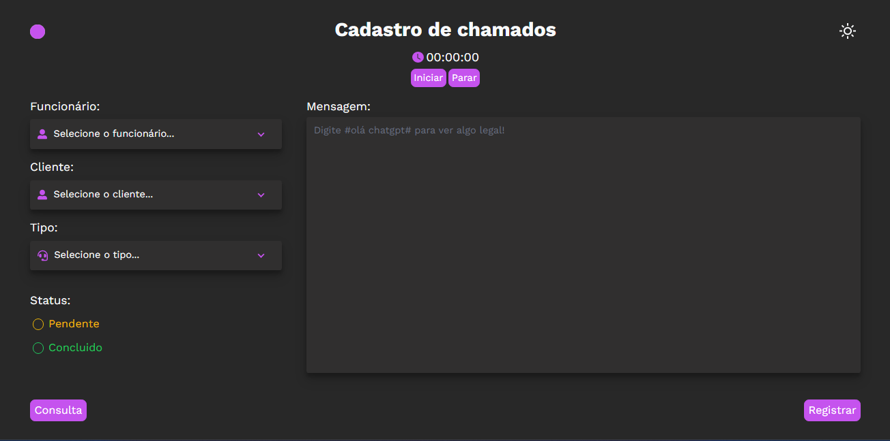

<h1 align="center">
  💻 <a href="https://portfolio-enzosylvestrin.vercel.app">helpDesk</a>
</h1>

<h4 align="center"><a href="#">Clique para visitar o projeto</a></h4>

## 📚 Introdução

Este é um site feito para registro de chamados, conta com inserção e consulta dos chamados.

## 💼 Tecnologias utilizadas

Algumas das tecnologias utilizadas para o desenvolvimento foram:

- HTML;
- CSS;
- Tailwindcss;
- TypeScript;
- Next;
- Framer motion;
- Radix-ui;
- React-icons.

---

<h2>👻 Autor</h2>

<table>
  <tr>
    <td align="center">
      <a href="https://github.com/EnzoSylvestrin">
         
        
          <b>Enzo Sylvestrin</b>
        
      </a>
    </td>
  </tr>
</table>
